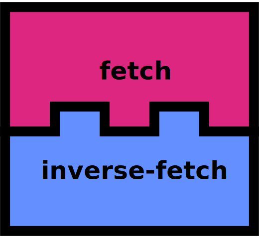

# Inverse Fetch

Inverse Fetch is a convention for defining HTTP routes in a way that is compatible with the [Fetch API](https://developer.mozilla.org/en-US/docs/Web/API/Fetch_API).



The obligatory "Hello World" example:

```typescript
// FetchHandler is an alias for `typeof fetch`
export const handler: FetchHandler = async (input) => {
  return new Response(`Hello World`)
}
```

Mount it in your express app:

```typescript
import express from 'express'
import { addRoute } from '@oselvar/inverse-fetch/express'
import { handler } from './handler'

addRoute({ router: app, method: 'get', path: '/hello', handler })
```

Or define an AWS Lambda function:

```typescript
import { toAwsLambdaHandler } from '@oselvar/inverse-fetch/aws-lambda'
import { handler as fetchHandler } from './handler'

export const handler = toAwsLambdaHandler({ handler })
```

## Why?

You might ask yourself why we need another convention for defining HTTP routes. After all, every JavaScript web framework has its own way of defining routes.

```typescript
// Express
app.get('/hello', (req, res) => {
  res.send('Hello World')
})
```

```typescript
// AWS Lambda
export const handler = async (event) => {
  return {
    statusCode: 200,
    body: 'Hello World',
  }
}
```

```typescript
// Fastify
fastify.get('/hello', async (request, reply) => {
  return 'Hello World'
})
```

All of these web frameworks have one thing in common: 
*They all have their own proprietary way of defining routes.*

That's fine if you are only using one web framework, but what if you want to use multiple web frameworks?

Why on earth would you want to use multiple web frameworks? Well, there are a few use cases:

## Local development

For instance, you might be using AWS Lambda during production. While it's possible to emulate AWS Lambda locally, you have to endure a very long delay between each change to your code. 

By using a web framework such as Express or Fastify during development, you can get instant feedback on your changes.

## Ultra-fast integration tests

Another use case is integration testing your JavaScript client and your server.

If your client uses the Fetch API, you can call your handler directly from the client. After all, the handler has exactly the same interface as `fetch`.

This allows you to write integration tests that can run in milliseconds.

## Helpers

The `fetch` API is fairly low-level. The `FetchHandler` is passed an `input` object which may be of type `string`, `Request` or `URL`,
A fair amount of type checking is required before you can extract values such as the request body, path parameters etc.

To make this easier, the `inverse-fetch` module provides a `FetchHelper` class that wraps the `input` and `init` arguments:

```typescript
// Inverse Fetch uses path patterns where path parameters are wrapped in curly braces.
// This is different from the Express convention where path parameters are prefixed with a colon.
// This is also used for file based routing.
const pathPattern = '/hello/{name}'

export const handler: FetchHandler = async (input) => {
  const helper = new FetchHelper(input, pathPattern)
  const params = helper.params()
  return helper.respond(new Response(`Hello World`))
}
```

### Path parameters

```typescript
```